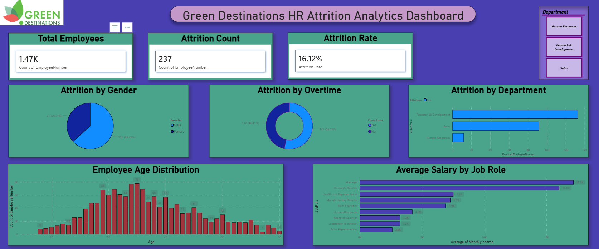

##  📑 Table of Contents

* [📌 Title and Description](#-title-and-description)
* [🎯 Project Objective](#-project-objective)
* [💼 Business Problem](#-business-problem)
* [🗂️ Dataset Information](#️-dataset-information)
* [🧹 Data Cleaning and Preparation](#-data-cleaning-and-preparation)
* [🛠️ Technology Stack](#️-technology-stack)
* [🚀 Project Workflow](#-project-workflow)
* [📊 Dashboard KPIs](#-dashboard-kpis)
* [📈 Dashboard Components](#-dashboard-components)
* [📊 Dashboard Insights](#-dashboard-insights)
* [🧮 DAX Measures](#-dax-measures)
* [🗃️ SQL Analysis](#️-sql-analysis)
* [▶️ How to Run the Project](#️-how-to-run-the-project)
* [📁 Project Structure](#-project-structure)
* [📋 Results and Conclusion](#-results-and-conclusion)
* [🔮 Future Enhancements](#-future-enhancements)
* [👨‍💻 Author & Contact](#-author--contact)

# 📊 HR Analytics: Employee Attrition Analysis

This project presents a comprehensive HR Analytics Dashboard developed using SQL, MySQL (XAMPP), and Power BI. The dashboard provides actionable insights into employee attrition, workforce demographics, salary distribution, and organizational trends to support data-driven HR decision-making.

## 🎯 Project Objective
The primary objective of this project is to analyze employee attrition patterns and identify the key factors influencing employee turnover. Using SQL, MySQL, Power BI, and DAX, the project provides meaningful insights into workforce behavior, helping HR professionals make informed decisions to improve employee retention and organizational performance.
 ## 💼 Business Problem

Employee attrition is a significant challenge for organizations, leading to increased recruitment costs, reduced productivity, loss of experienced employees, and disruptions to business operations.

This project analyzes workforce data to identify employee attrition patterns, understand the factors influencing employee turnover, and provide actionable insights that support data-driven HR decision-making and employee retention strategies.

 ## 🗂️ Dataset Information

The dataset contains employee workforce information used to analyze employee attrition and identify factors influencing employee turnover. It includes demographic details, job-related information, compensation data, work experience, and employment status. The dataset serves as the foundation for SQL analysis, DAX calculations, and Power BI dashboard development, enabling meaningful insights into workforce trends and HR performance.

### Key Attributes

* Employee Number
* Age
* Gender
* Department
* Job Role
* Monthly Income
* Years at Company
* Overtime
* Attrition Status

 ## 🧹 Data Cleaning & Preparation

The dataset was cleaned and prepared to ensure data quality, consistency, and accuracy before performing SQL analysis and building the Power BI dashboard.

### Data Cleaning & Preparation Tasks

* Imported the employee dataset into MySQL (XAMPP).
* Verified the dataset structure, column names, and data types.
* Checked for missing and null values.
* Identified and removed duplicate records where applicable.
* Standardized categorical values for consistency.
* Validated numerical fields to ensure accurate calculations.
* Prepared the dataset for SQL analysis, DAX calculations, and Power BI visualization.

 ## 🛠️ Technology Stack

| Technology         | Purpose                                    |
| ------------------ | ------------------------------------------ |
| Power BI           | Dashboard Development & Data Visualization |
| MySQL (XAMPP)      | Database Management System                 |
| SQL                | Data Extraction & Analysis                 |
| DAX                | KPI & Business Calculations                |
| Visual Studio Code | SQL Scripts & Documentation                |
| GitHub             | Version Control & Project Hosting          |

##  🔄 Project Workflow

### 1. Data Collection

* Collected the Employee Attrition dataset.
* Imported the dataset into the MySQL database using XAMPP.

### 2. Data Cleaning

* Validated the dataset for accuracy and consistency.
* Checked for missing and null values.
* Verified data types and column names.
* Removed duplicate records (if any).
* Standardized categorical values.
* Prepared the dataset for SQL analysis and Power BI visualization.

### 3. SQL Analysis

* Performed employee attrition analysis using SQL queries.
* Generated department-wise and demographic insights.
* Calculated workforce metrics and KPIs.

### 4. Data Modeling

* Connected the MySQL database to Power BI.
* Built and optimized the data model.
* Established relationships between tables (where applicable).

### 5. DAX Development

* Created KPI measures using DAX.
* Developed custom calculations for dashboard reporting.
* Optimized measures for interactive analysis.

### 6. Dashboard Development

* Designed an interactive HR Analytics Dashboard.
* Created KPI cards, charts, and visualizations.
* Implemented slicers and filters for dynamic reporting.
* Built an intuitive layout for effective business insights.

## 📊 Dashboard KPIs

The dashboard displays key performance indicators (KPIs) that provide a high-level overview of employee attrition and workforce metrics.

| KPI                 | Description                                                       |
| ------------------- | ----------------------------------------------------------------- |
| **Total Employees** | Displays the total number of employees in the organization.       |
| **Attrition Count** | Shows the total number of employees who left the organization.    |
| **Attrition Rate**  | Represents the percentage of employees who left the organization. |

 ## 📈 Dashboard Components

The dashboard consists of interactive visualizations that provide comprehensive insights into employee attrition and workforce trends.

### 📊 KPI Cards

* Total Employees
* Attrition Count
* Attrition Rate

### 📉 Attrition Analysis

* Attrition by Department
* Attrition by Gender
* Attrition by Overtime

### 👥 Workforce Demographics

* Employee Age Distribution

### 💰 Compensation Analysis

* Average Salary by Job Role

### 🎛️ Interactive Features

* Department Slicer
* Cross-Filtering Across Visuals
* Interactive Charts
* Dynamic Dashboard Navigation


##  📊 Dashboard Insights

* Provides an overview of employee attrition across the organization.
* Highlights departments with higher employee turnover.
* Analyzes the impact of overtime on attrition patterns.
* Presents workforce demographics such as age and gender trends.
* Shows compensation insights through salary analysis by job role.
* Supports data-driven HR decision-making through interactive visual analysis.

 ## 🧮 DAX Measures

DAX (Data Analysis Expressions) was used to create calculated measures that support KPI reporting and interactive dashboard analysis. These measures enable dynamic calculations and enhance the analytical capabilities of the Power BI dashboard.

### DAX Measures

* Total Employees
* Attrition Count
* Attrition Rate

 ## 🗃️ SQL Analysis

SQL was used to extract, analyze, and summarize employee data stored in the MySQL database. Analytical queries were developed to calculate key workforce metrics and generate insights for dashboard visualizations.

### SQL Analysis Performed

* Total Employees Analysis
* Employee Attrition Count
* Employee Attrition Rate
* Department-wise Attrition Analysis
* Age-wise Attrition Analysis
* Average Salary Analysis
* Average Years at Company Analysis
* Overtime Impact Analysis

 ## 🚀 How to Run the Project

### 1. Database Setup

* Install and launch **XAMPP**.
* Start the **Apache** and **MySQL** services.
* Open **phpMyAdmin**.
* Create a new MySQL database.
* Import the Employee Attrition dataset into the database.

### 2. SQL Analysis

* Open the `analysis_queries.sql` file.
* Execute the SQL queries using **phpMyAdmin** or **MySQL Workbench**.
* Verify the generated results.

### 3. Power BI Dashboard

* Open the `Green_Destinations_HR_Analytics_Dashboard.pbix` file in **Power BI Desktop**.
* Connect the dashboard to the MySQL database if required.
* Refresh the data to load the latest dataset.

### 4. Explore the Dashboard

* Use the **Department** slicer to filter the data.
* Analyze the KPI cards and interactive visualizations.
* Explore employee attrition trends, workforce demographics, and salary analysis.

##  📁 Project Structure

```text id="kj3n8p"
HR-Analytics-Employee-Attrition-Analysis/
│
├── data/
│   └── greendestination.csv
│
├── powerbi/
│   ├── HR_Analytics_Dashboard.pbix
│   └── dax_measures.txt
│
├── sql/
│   ├── green_destinations_hr.sql
│   └── analysis_queries.sql
│
├── presentation/
│   └── HR_Analytics_Presentation.pdf
│
├── report/
│   └── Project_Report.pdf
│
├── screenshots/
│   ├── Dashboard_Full.png
│   ├── KPI_Cards.png
│   ├── Charts.png
│   ├── Database_Full.png
│   ├── Data_Validation_Total_Records_Check.png
│   ├── Data_Validation_Missing_Values_Check.png
│   └── Data_Validation_Duplicate_Employee_Check.png
│
├── README.md
└── .gitignore
```

 ## 📋 Results & Conclusion

This project successfully identified key factors contributing to employee attrition and workforce turnover.

By combining SQL analysis with Power BI visualization, the dashboard provides meaningful insights that support HR planning, employee retention strategies, and workforce optimization.

 ## 🔮 Future Enhancements

*  Employee Attrition Prediction
*  Machine Learning Integration
*  Workforce Forecasting
*  Advanced HR Analytics

##  👨‍💻 Author & Contact

**Prasannajit Biswal**
Data Analyst Internship Project

* 📧 Email: [prasanjitbiswal78@gmail.com](mailto:your-email@example.com)
* 💼 LinkedIn: [https://www.linkedin.com/in/prasanjit-biswal-7020a1333](https://linkedin.com/in/your-linkedin-id)
